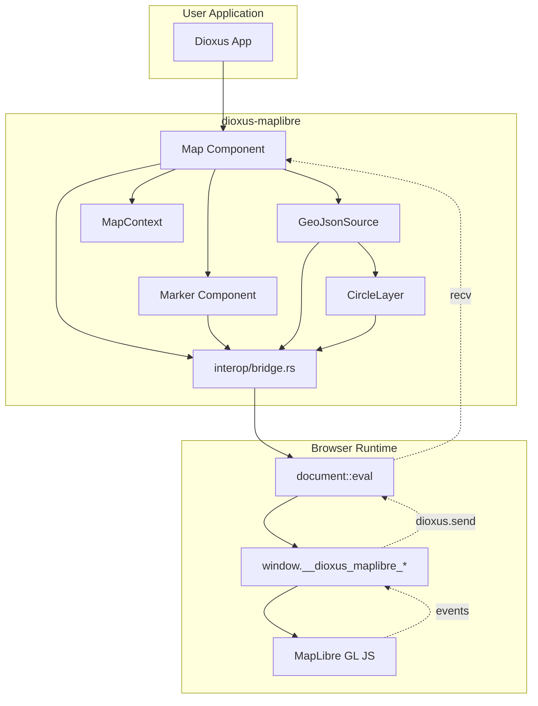
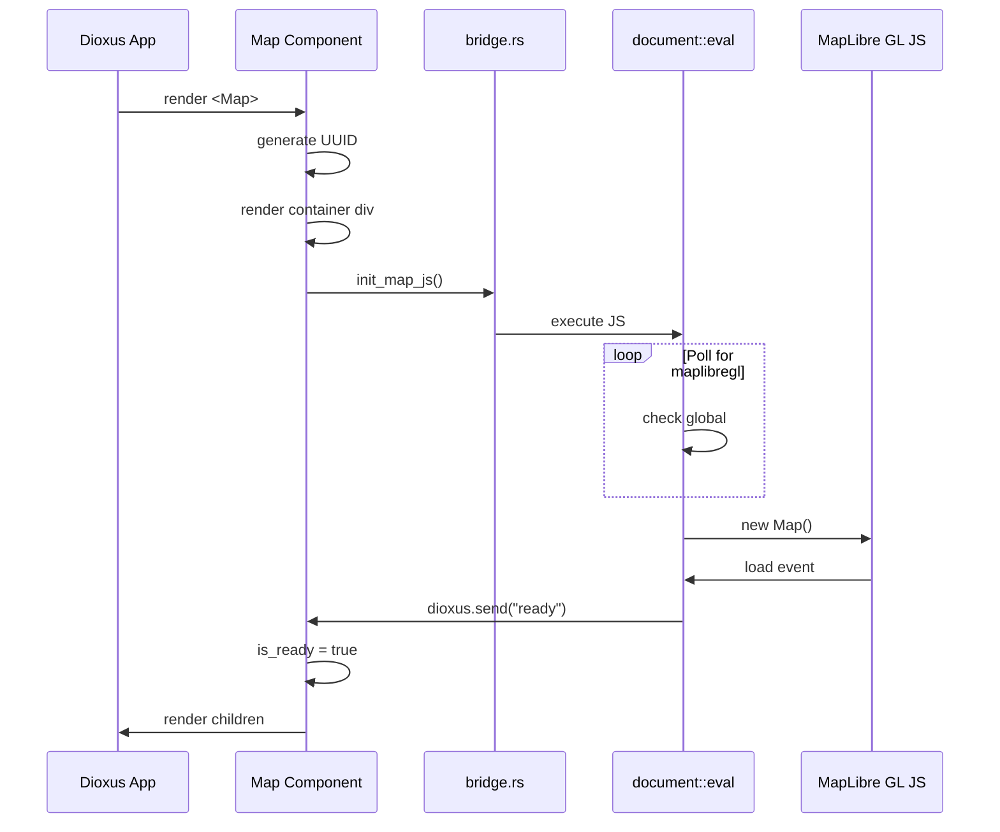
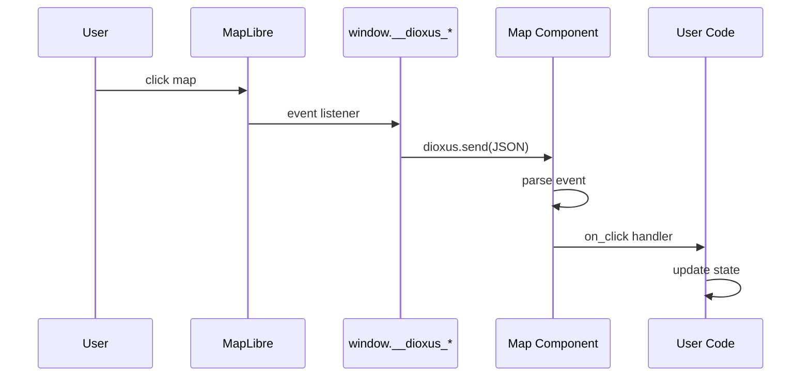

# Codebase Map

> Auto-generated by Cartographer. Last mapped: 2026-01-17

## System Overview



## Directory Structure

```
src/
├── lib.rs              # Public API exports
├── types.rs            # LatLng, MapPosition, Bounds, Point
├── events.rs           # Event types (MapClickEvent, etc.)
├── context.rs          # MapContext for parent-child communication
├── components/
│   ├── mod.rs          # Component re-exports
│   ├── map.rs          # Main Map component + fly_to/pan_by
│   ├── marker.rs       # Marker component
│   ├── popup.rs        # Popup placeholder
│   ├── geojson_source.rs   # GeoJSON data source
│   └── circle_layer.rs     # Circle layer for point features
└── interop/
    ├── mod.rs          # Internal exports (pub(crate))
    └── bridge.rs       # JS code generation (~700 lines)

tests/
├── events.rs           # Event serialization tests
└── types.rs            # Geographic type tests

examples/showcase/      # Interactive demo app (used for E2E)
├── src/main.rs
├── Cargo.toml
└── Dioxus.toml

e2e/
├── tests/              # Playwright E2E tests
├── native-showcase/    # Native MapLibre reference for comparison
└── playwright.config.ts
```

## Module Guide

### Core Types (`src/types.rs`)

**Purpose**: Geographic and geometric type definitions

| Type | Purpose |
|------|---------|
| `LatLng` | Geographic coordinate (lat/lng pair) |
| `MapPosition` | Center + zoom combination |
| `Bounds` | Bounding box (SW/NE corners) |
| `Point` | Screen pixel coordinates |

**Key Methods**:
- `LatLng::to_array()` - Converts to `[lng, lat]` (MapLibre format)
- `LatLng::from_array()` - Converts from `[lng, lat]`
- `Bounds::contains()` - Point-in-bounds test

**Gotcha**: MapLibre uses `[lng, lat]` order, not `[lat, lng]`

---

### Events (`src/events.rs`)

**Purpose**: Event type definitions for map interactions

| Event | Description |
|-------|-------------|
| `MapClickEvent` | Map click with latlng + pixel coords |
| `MarkerClickEvent` | Marker click with marker_id + latlng |
| `MarkerHoverEvent` | Marker hover enter/leave |
| `MapMoveEvent` | Pan/zoom changes |
| `LayerClickEvent` | Feature click with properties |
| `LayerHoverEvent` | Feature hover with cursor position |

**Internal**: `MapEvent` enum uses `#[serde(tag = "type")]` for JSON dispatch

---

### Context (`src/context.rs`)

**Purpose**: React-style context for parent-child component communication

```rust
// In Map component:
use_context_provider(|| MapContext::new(map_id));

// In child components:
let ctx = use_context::<MapContext>();
if ctx.is_ready() { /* render */ }
```

**Fields**:
- `map_id: String` - Unique map instance identifier
- `is_ready: Signal<bool>` - True when map has loaded

---

### Map Component (`src/components/map.rs`)

**Purpose**: Main Map component and navigation functions

**Exports**: `Map`, `MapProps`, `fly_to()`, `pan_by()`

**Lifecycle**:
1. Generate unique map_id (UUID)
2. Render container div
3. `use_effect` spawns async init:
   - Poll for MapLibre GL JS (max 10 seconds)
   - Wait for container element (with fallback finder)
   - Create map via `init_map_js()`
   - Set up event listeners
4. Event loop processes `eval.recv()`
5. Children render when `is_ready` is true
6. Cleanup on unmount

**Props**:
| Prop | Type | Description |
|------|------|-------------|
| `style` | String | MapLibre style URL |
| `center` | LatLng | Initial position |
| `zoom` | f64 | Initial zoom level |
| `height/width` | String | CSS dimensions |
| `on_click` | EventHandler | Map click handler |
| `on_marker_click` | EventHandler | Marker click handler |
| `on_move` | EventHandler | Pan/zoom handler |
| `children` | Element | Child components |

---

### Marker Component (`src/components/marker.rs`)

**Purpose**: Map pins with optional popups

**Props**:
| Prop | Type | Description |
|------|------|-------------|
| `position` | LatLng | Marker location |
| `id` | Option<String> | Optional stable ID |
| `emoji` | Option<String> | Emoji icon (e.g., "📷") |
| `popup` | Option<String> | Popup HTML content |

**Gotcha**: Returns empty `rsx! {}` - marker is JS-side only

---

### GeoJsonSource Component (`src/components/geojson_source.rs`)

**Purpose**: GeoJSON data source for layers

**Props**:
| Prop | Type | Description |
|------|------|-------------|
| `id` | String | Unique source ID |
| `data` | String | GeoJSON as JSON string |
| `children` | Element | Child layer components |

**Usage**: Wrap `CircleLayer` inside `GeoJsonSource`

---

### CircleLayer Component (`src/components/circle_layer.rs`)

**Purpose**: Render point features as circles

**Props**:
| Prop | Type | Description |
|------|------|-------------|
| `id` | String | Unique layer ID |
| `source` | String | Source ID to reference |
| `paint` | Option<Value> | Circle styling |
| `layout` | Option<Value> | Layout properties |

**Default Paint**: Blue circles with black stroke

---

### JS Interop (`src/interop/bridge.rs`)

**Purpose**: JavaScript code generation for MapLibre GL JS

**Key Globals**:
- `window.__dioxus_maplibre_maps[mapId]` - Map instances
- `window.__dioxus_maplibre_markers[mapId]` - Markers per map
- `window.__dioxus_maplibre_sources[mapId]` - Sources per map
- `window.__dioxus_maplibre_layers[mapId]` - Layers per map
- `window.__dioxus_maplibre_sendEvent(json)` - Global event callback

**Functions** (all `pub(crate)`):
| Function | Purpose |
|----------|---------|
| `generate_map_id()` | Create UUID-based map ID |
| `init_map_js()` | Initialize map with polling |
| `add_marker_js()` | Add marker with handlers |
| `remove_marker_js()` | Remove marker |
| `fly_to_js()` | Animated navigation |
| `add_geojson_source_js()` | Add data source |
| `add_layer_js()` | Add layer with events |
| `destroy_map_js()` | Cleanup everything |

---

## Data Flow

### Initialization Sequence



### Event Flow



### Why Global sendEvent?

Markers are added via separate `document::eval()` calls, which create isolated JavaScript contexts. The `dioxus.send()` function only works within the eval that created it. The global `window.__dioxus_maplibre_sendEvent` callback bridges this gap, allowing markers to send events back to the Map component's event loop.

---

## Key Patterns

### 1. Platform-Conditional Interop
```rust
#[cfg(target_arch = "wasm32")]
{
    // JS interop code
}
```

### 2. Dual-ID Storage (Hot-Reload Resilience)
```javascript
window.__dioxus_maplibre_maps[actualContainerId] = map;
window.__dioxus_maplibre_maps[map_id] = map;
```

### 3. Signal-Based Readiness
```rust
if ctx.is_ready() {
    // Safe to execute JS interop
}
```

### 4. Empty Component Rendering
JS-only components return empty RSX:
```rust
rsx! {}
```

### 5. Polling Initialization
MapLibre loads async via CDN, so poll until available:
```javascript
while (typeof maplibregl === 'undefined' && attempts < maxAttempts) {
    await new Promise(r => setTimeout(r, 100));
}
```

---

## Conventions

### Naming
- Components: PascalCase (`Map`, `Marker`, `GeoJsonSource`)
- Functions: snake_case (`fly_to`, `pan_by`)
- JS generators: snake_case with `_js` suffix (`init_map_js`)
- IDs: prefixed (`map_`, `marker_`, `source_`, `layer_`)

### File Organization
- One component per file
- Types in dedicated module
- Events in dedicated module
- All JS interop in `bridge.rs`

### Testing
- Unit tests for types and serialization
- E2E tests with Playwright
- Visual regression against native MapLibre

---

## Gotchas

### 1. Coordinate Order
MapLibre uses `[lng, lat]`, not `[lat, lng]`. Use `LatLng::to_array()`.

### 2. Hot-Reload ID Mismatch
Dioxus hot-reload remounts components with new UUIDs. The fallback container finder handles this.

### 3. Event Context Isolation
`document::eval()` creates isolated contexts. Use global `sendEvent` for cross-eval communication.

### 4. Async Script Loading
MapLibre GL JS loads via CDN. The 10-second polling timeout may affect slow connections.

### 5. Layer Requires Source
Layers must be added after their source. Wrap layers inside source components.

### 6. Popup HTML Injection
Popup content is HTML string, not RSX. No reactivity in popups.

### 7. Feature ID Constraint
MapLibre feature state requires numeric IDs (`i64`). String IDs not supported.

---

## Navigation Guide

**To add a new component**:
1. Create file in `src/components/`
2. Export from `src/components/mod.rs`
3. Re-export from `src/lib.rs`

**To add a new event type**:
1. Add struct in `src/events.rs`
2. Add variant to `MapEvent` enum
3. Handle in `map.rs` event loop
4. Add callback prop to `MapProps`

**To add JS interop function**:
1. Add function in `src/interop/bridge.rs`
2. Export from `src/interop/mod.rs` (pub(crate))
3. Call from component with `document::eval()`

**To run E2E tests**:
```bash
cd examples/showcase && dx serve --port 8080 &
cd e2e && bun install && bun test
```

---

## File Dependencies

```
lib.rs
├── types.rs (re-exports)
├── events.rs (re-exports)
├── context.rs (re-exports)
├── interop/ (private)
│   └── bridge.rs
└── components/
    ├── mod.rs (re-exports)
    ├── map.rs → bridge, context, events, types
    ├── marker.rs → bridge, context, types
    ├── popup.rs
    ├── geojson_source.rs → bridge, context
    └── circle_layer.rs → bridge, context
```

---

## Dependencies

### Runtime (Browser)
- MapLibre GL JS v4+ (loaded via CDN)
- Modern browser with WASM support

### Build
- Rust edition 2024
- wasm32-unknown-unknown target
- Dioxus CLI for examples

### Testing
- Bun runtime
- Playwright
