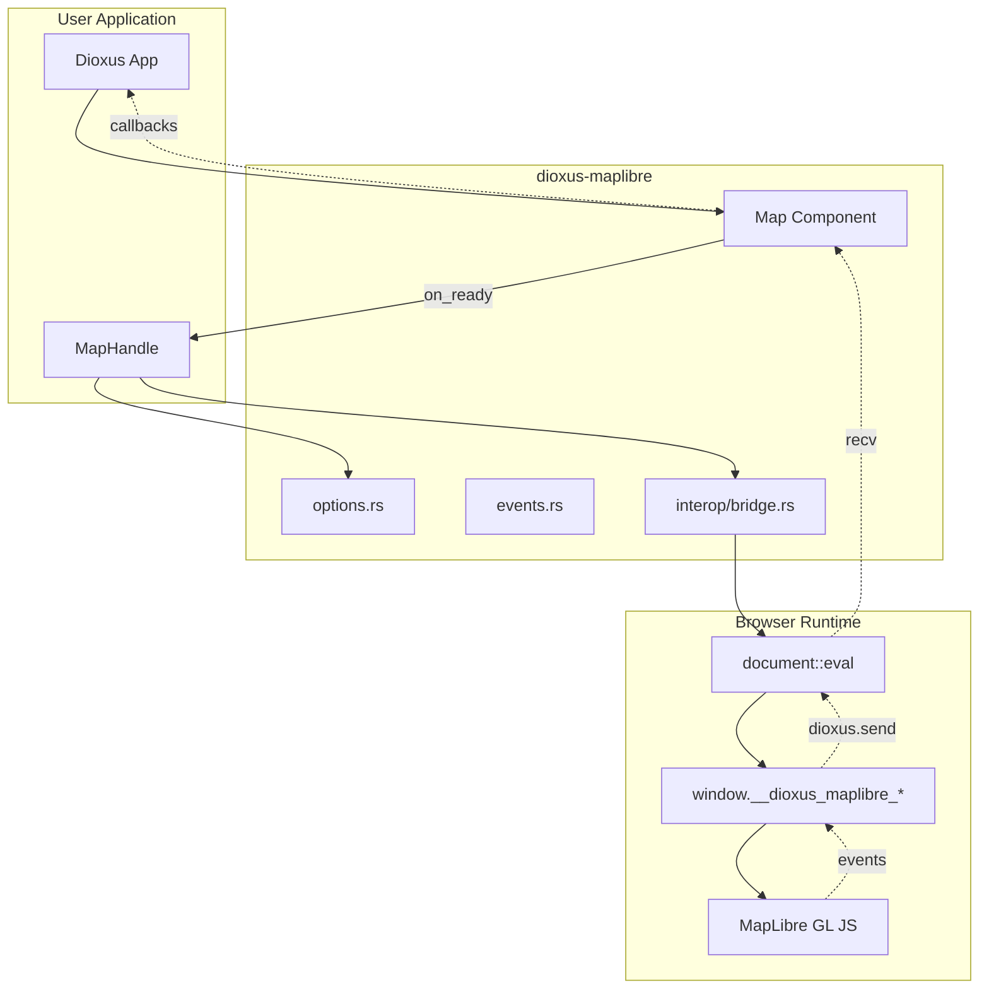
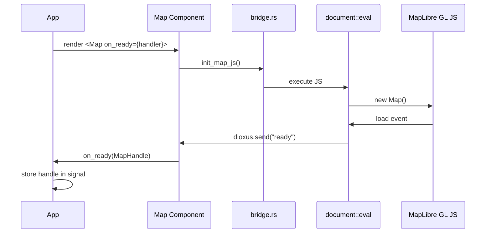
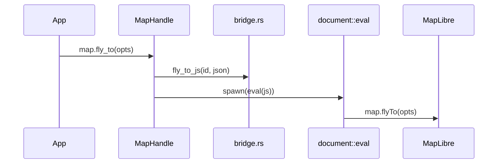
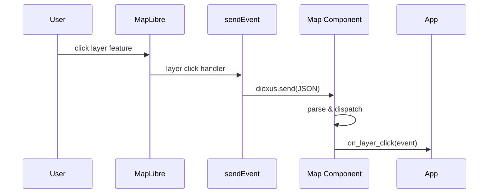

# Codebase Map

> Updated: 2026-02-06

## System Overview



## Directory Structure

```
src/
├── lib.rs              # Public API re-exports
├── types.rs            # LatLng, MapPosition, Bounds, Point
├── events.rs           # All event types + MapEvent enum
├── options.rs          # Option/builder types (serde → camelCase JSON)
├── handle.rs           # MapHandle with all map methods
├── components/
│   ├── mod.rs          # Only exports Map
│   └── map.rs          # Map component, props, event loop
└── interop/
    ├── mod.rs          # Re-exports bridge
    └── bridge.rs       # ~50 JS generator functions

tests/
├── types.rs            # Geographic type tests
├── events.rs           # Event serialization tests
└── options.rs          # Option type serialization tests

examples/showcase/      # Multi-page demo app with router
├── src/
│   ├── main.rs         # Router + AppLayout
│   └── pages/          # 10 feature demo pages
├── Cargo.toml
└── Dioxus.toml

e2e/                    # Playwright behavioral tests
├── tests/              # 7 spec files
├── playwright.config.ts
└── package.json
```

## Module Guide

### Types (`src/types.rs`)

Geographic and geometric type definitions.

| Type | Purpose |
|------|---------|
| `LatLng` | Geographic coordinate (lat/lng pair) |
| `MapPosition` | Center + zoom combination |
| `Bounds` | Bounding box (SW/NE corners) |
| `Point` | Screen pixel coordinates |

**Gotcha**: MapLibre uses `[lng, lat]` order, not `[lat, lng]`. Use `LatLng::to_array()`.

---

### Events (`src/events.rs`)

All event types for map interactions.

| Event | Fired When |
|-------|------------|
| `MapClickEvent` | Map clicked |
| `MapDblClickEvent` | Map double-clicked |
| `MapContextMenuEvent` | Right-click on map |
| `MarkerClickEvent` | Marker clicked |
| `MarkerHoverEvent` | Mouse enters/leaves marker |
| `MapMoveEvent` | Pan/zoom/rotate completes |
| `MapZoomEvent` | Zoom changes |
| `MapRotateEvent` | Bearing changes |
| `MapPitchEvent` | Pitch changes |
| `LayerClickEvent` | Feature in layer clicked |
| `LayerHoverEvent` | Feature in layer hovered |

Internal `MapEvent` enum uses `#[serde(tag = "type")]` for JSON dispatch.

---

### Options (`src/options.rs`)

Serializable option types that map to MapLibre JS API parameters.

| Type | Used By |
|------|---------|
| `GeoJsonSourceOptions` | `add_geojson_source()` |
| `VectorSourceOptions` | `add_vector_source()` |
| `RasterSourceOptions` | `add_raster_source()` |
| `RasterDemSourceOptions` | `add_raster_dem_source()` |
| `ImageSourceOptions` | `add_image_source()` |
| `LayerOptions` | `add_layer()` — has builder pattern |
| `MarkerOptions` | `add_marker()` |
| `PopupOptions` | `add_popup()` |
| `FlyToOptions` | `fly_to()` |
| `EaseToOptions` | `ease_to()` |
| `JumpToOptions` | `jump_to()` |
| `FitBoundsOptions` | `fit_bounds()` |
| `TerrainOptions` | `set_terrain()` |
| `SkyOptions` | `set_sky()` (JSON passthrough) |
| `FeatureIdentifier` | `set_feature_state()` / `remove_feature_state()` |
| `ControlPosition` | All control methods |
| `Padding` | Navigation option padding |

All use `#[serde(rename_all = "camelCase")]` and `#[serde(skip_serializing_if = "Option::is_none")]`.

**Design decision**: Paint/layout use `serde_json::Value` because MapLibre's style spec has hundreds of properties with expression support — typing them would be enormous maintenance for zero benefit.

---

### MapHandle (`src/handle.rs`)

The primary API for all map operations. Lightweight `Clone` wrapper around map ID.

**Categories**:
- Sources: add/update/remove GeoJSON, vector, raster, raster-dem, image
- Layers: add/remove, set paint/layout properties, set filter
- Controls: navigation, geolocate, scale, fullscreen, attribution
- Markers: add/remove/update position
- Popups: add/remove
- Navigation: fly_to, ease_to, jump_to, fit_bounds, pan_to/by, zoom, rotate, pitch
- Feature state: set/remove
- Images: load/remove
- Style: set_style
- Terrain/Sky: set/remove
- Layer events: on_layer_click, on_layer_hover
- Getters (async): get_zoom, get_center, get_bearing, get_pitch, get_bounds
- Escape hatch: eval, eval_async

**Pattern**: Fire-and-forget methods use `spawn(async { eval(&js).await })`. Async getters use `eval(&js).join::<T>().await`.

---

### Map Component (`src/components/map.rs`)

The only Dioxus component. Renders a container div and manages the MapLibre lifecycle.

**Props**:
| Prop | Type | Default |
|------|------|---------|
| `style` | String | Dark Matter |
| `center` | LatLng | Helsinki |
| `zoom` | f64 | 10.0 |
| `bearing` | f64 | 0.0 |
| `pitch` | f64 | 0.0 |
| `min_zoom` | Option<f64> | None |
| `max_zoom` | Option<f64> | None |
| `max_bounds` | Option<Bounds> | None |
| `height/width` | String | "100%" |
| `on_ready` | EventHandler<MapHandle> | — |
| `on_click` | EventHandler<MapClickEvent> | — |
| `on_dblclick` | EventHandler<MapDblClickEvent> | — |
| `on_contextmenu` | EventHandler<MapContextMenuEvent> | — |
| `on_marker_click` | EventHandler<MarkerClickEvent> | — |
| `on_marker_hover` | EventHandler<MarkerHoverEvent> | — |
| `on_move` | EventHandler<MapMoveEvent> | — |
| `on_zoom` | EventHandler<MapZoomEvent> | — |
| `on_rotate` | EventHandler<MapRotateEvent> | — |
| `on_pitch` | EventHandler<MapPitchEvent> | — |
| `on_layer_click` | EventHandler<LayerClickEvent> | — |
| `on_layer_hover` | EventHandler<LayerHoverEvent> | — |
| `children` | Element | HTML overlays |

**Lifecycle**:
1. Generate unique map_id (UUID)
2. Render container div
3. `use_effect` spawns async init (polls for MapLibre, waits for container)
4. Event loop processes `eval.recv::<String>()` → dispatches to callbacks
5. On `"ready"` event: creates MapHandle, calls `on_ready`
6. Cleanup on unmount via `use_drop`

---

### JS Bridge (`src/interop/bridge.rs`)

~50 functions generating JavaScript strings for MapLibre GL JS operations.

**Key globals**:
- `window.__dioxus_maplibre_maps[id]` — Map instances
- `window.__dioxus_maplibre_markers[id]` — Markers per map
- `window.__dioxus_maplibre_sendEvent(json)` — Global event bridge

**Why global sendEvent?** Each `document::eval()` creates an isolated JS context with its own `dioxus.send()`. Markers, layers, and other objects added via separate evals need a shared callback.

**Pattern**: All functions use `find_map_js()` helper for map lookup with fallback.

---

## Data Flow

### Initialization



### Using MapHandle



### Event Flow



---

## Showcase App

10-page Dioxus 0.7 router app demonstrating all features:

| Page | Feature |
|------|---------|
| Basic | Click events, move tracking, event log |
| Markers | Default, emoji, popup, draggable, add/remove |
| Sources | GeoJSON with clustering, dynamic updates |
| Layers | Circle, line, fill layers, toggle visibility |
| Controls | Navigation, scale, fullscreen, geolocate |
| Navigation | flyTo, easeTo, jumpTo, fitBounds, zoom/pan |
| Interaction | Layer click/hover, feature state hover effects |
| Terrain | Raster DEM source, 3D terrain toggle |
| Style | Style switching between providers |
| Eval | Raw JS eval, async getters |

---

## Gotchas

1. **Coordinate order**: MapLibre uses `[lng, lat]`, not `[lat, lng]`
2. **Paint/layout as Value**: Use `json!({})` — style spec is too large to type
3. **Layer events separate**: Call `on_layer_click("id")` after `add_layer(...)`
4. **Feature IDs**: Must be numeric `i64` for feature state
5. **Popup content**: HTML string, not RSX
6. **Platform guards**: `#[cfg(target_arch = "wasm32")]` on all JS interop
7. **Children are HTML**: Map children are DOM overlays, not map objects
8. **Hot-reload**: UUID remounting handled by fallback container finder
